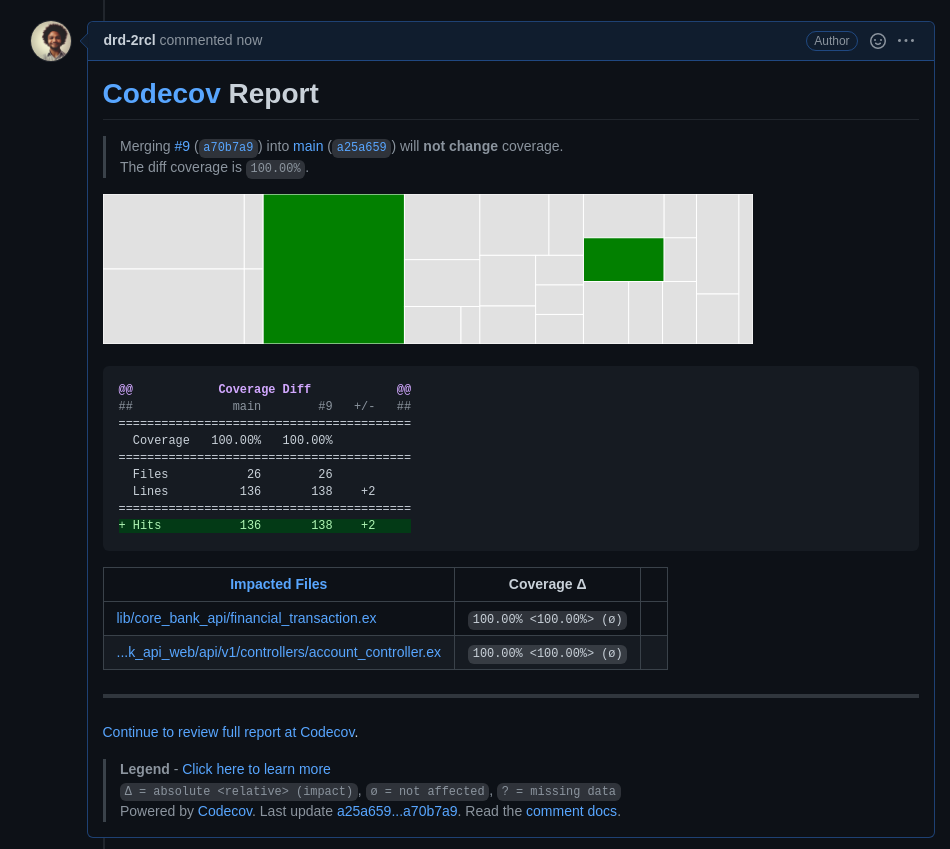
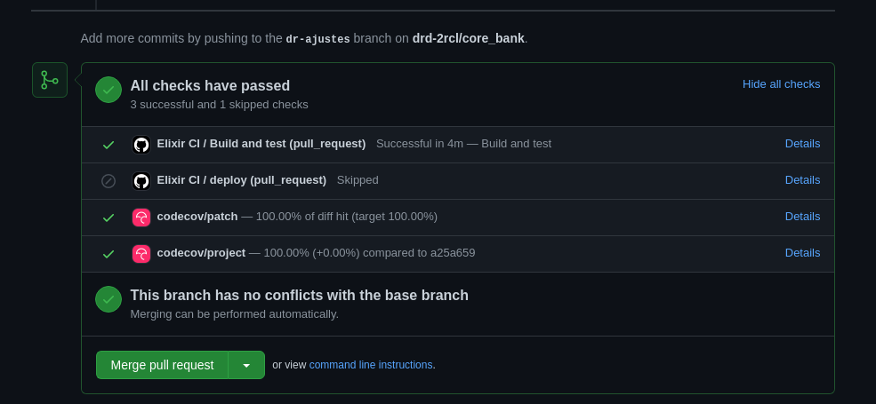

# CoreBankApi


[](https://codecov.io/gh/drd-2rcl/core_bank)

<details open="open">
  <summary>Conteúdo</summary>
  <ol>
    <li>
      <a href="#sobre-o-projeto">Sobre o projeto</a>
    </li>
    <li>
      <a href="#começando">Começando</a>
      <ul>
        <li><a href="#pré-requisitos">Pré-requisitos</a></li>
        <li><a href="#instalção">Instalação</a></li>
      </ul>
    </li>
    <li>
      <a href="#documentação-api">Testes</a>
    </li>
    <li>
      <a href="#documentação-api">Documentação API</a>
    </li>
  </ol>
</details>

## Sobre o projeto

Este projeto foi realizado pensando nos seguintes requisitos:

1. Criação de usuário com saldo em conta de R$ 1000,00.
2. Transferência de dinheiro entre contas.
3. Saque do dinheiro com envio de email ao usuário.
4. Contas não podem ficar zeradas.
5. Autenticação.
6. Geração de relatórios com o total transacionado, dia, mês e ano.

As configurações das ferramentas foram realizadas na geração do projeto, assim pode-se acompanhar a abertura de Pull Requests e as actions do github para validações de:

```
mix format --check-formatted
mix credo --strict
mix coveralls.json
mix test
```

Após as validações é gerado um relatório com a cobertura de testes dentro do PR e no caso de diminuição da porcentagem, o CI falha impossibilitando o merge da branch até que seja entregue os testes faltantes.



Com o PR finalizado e validado pelas ferramentas, é liberado o merge e após as devidas validações na branch main é iniciado o processo de deploy no Gigalixir.



Desta forma, fica automatizado:

```
1. Cobertura de testes.
2. Validações dos padrões do projeto.
3. Processo de Deploy
```

## Começando

### Pré-requisitos

É necessário ter instalado na sua máquina:

- docker: [https://docs.docker.com/get-started/#download-and-install-docker](https://docs.docker.com/get-started/#download-and-install-docker)
- docker-compose: [https://docs.docker.com/compose/install/](https://docs.docker.com/compose/install/)

### Instalação

- Faça o clone do repositório `git clone git@github.com:drd-2rcl/core_bank.git`

```bash
git clone git@github.com:drd-2rcl/core_bank.git
cd core_bank
docker-compose build
docker-compose up
docker-compose run api mix setup
```

Pronto, temos a nossa aplicação em pé e você pode visitar o [`localhost:4000`](http://localhost:4000) no seu browser.

### Testes

Para rodar a suíte de testes:

```bash
docker-compose run api mix test
```

E para verificar a cobertura:

```bash
docker-compose run api mix test --cover
```

### Documentação API

A documentação da API foi disponibilizada neste [link](https://documenter.getpostman.com/view/5077223/Tzsikixr) público do postman. E também criei este workspace público que pode ser acessado [aqui](https://www.postman.com/orange-flare-200437/workspace/corebankapi/request/5077223-4b6f2bbf-3985-4d49-af60-4a1c8a14257f).

Não esqueça de selecionar os ambientes (desenvolvimento ou produção) para realizar os requests, pois a `base_url` altera de um para o outro.

Todas as rotas necessitam de autenticação via Bearer Token, exceto na `criação de usuários` e `sign_in`. Inclusive são as rotas em que o token é gerado e respondido.

As requisições para as rotas `transfers`, `withdraw` e `report` são feitos com base no `id` da conta que pode ser resgatado quando o usuário é criado. Existem validações no caso de id inválido ou o id não exitir no banco.

Os envios de email nas realizações de saque ocorrem em ambiente de desenvolvimento. Para validar o envio acesse a rota [`localhost:4000/sent_emails`](http://localhost:4000/sent_emails)

Este é o [link](https://vain-silver-verdin.gigalixirapp.com/) da api em produção.

Grato pelo oportunidade :).
